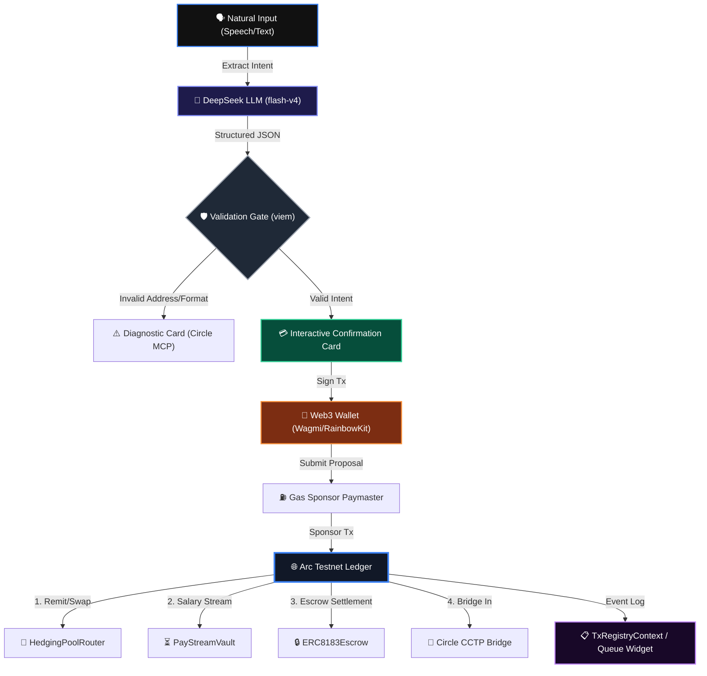

# WireStable: Intelligent Stablecoin Remittance & Treasury Orchestrator

An AI-driven agentic interface facilitating conversational gasless payments, cross-chain CCTP bridging, automated salary streams, and multi-signature escrow settlements natively on the **Arc Testnet** and **Sepolia** networks.

---

## 🗺️ Platform Topology

WireStable bridges natural human intent with robust on-chain transactional infrastructure. The platform decouples conversational intelligence from critical cryptographic execution, ensuring complete self-custody while using AI agents as smart routing companions.



---

## ⚡ Product Surface & Core Capabilities

| Capability Module | Core Mechanism | Protocol Impact |
| :--- | :--- | :--- |
| **Conversational Rail** | Semantic parsing via `deepseek-v4-flash` to identify intents (remit, swap, stream, escrow). | Replaces complex web-forms with voice/text inputs. |
| **Gasless Paymaster** | Custom sponsorship endpoint `/api/paymaster/sponsor` utilizing agent-signed gas funding. | Gas fees are abstracted natively; transactions feel instant and free. |
| **Continuous Streams** | On-chain time-based token routing via the customized `PayStreamVault` contract. | Automates continuous, per-second worker compensation. |
| **Milestone Escrow** | Standardized `ERC8183Escrow` for gig economy payments, verified by off-chain proof URLs. | Secures buyer-provider engagements with programmatic release. |
| **Cross-Chain CCTP** | Direct interaction with Circle Cross-Chain Transfer Protocol via unified provider configs. | Allows bridging USDC from Sepolia, Base, or Arbitrum directly to Arc. |
| **StableFX Exchange** | Server-side integration with Circle StableFX query engine and on-chain swap fallback. | Zero-slippage FX conversion (USDC ⇋ EURC) on Arc Testnet. |

---

## ⚙️ Core Protocol Contracts (Arc Testnet)

The transaction engine interacts directly with the following deployed contracts on the Arc Network (Chain ID: `5042002`):

*   **ERC8004 Registry:** [`0xee695688cc3c1fddd33afd8b6e84a1abcf59ded4`](https://testnet.arcscan.app/address/0xee695688cc3c1fddd33afd8b6e84a1abcf59ded4)
    *   *Role:* Resolves agent validation schema signatures and verifies message authenticity.
*   **PayStreamVault:** [`0xaa838872afb7ab462856123ffe97ed47d95e8dc5`](https://testnet.arcscan.app/address/0xaa838872afb7ab462856123ffe97ed47d95e8dc5)
    *   *Role:* Handles continuous salary streams using micro-USDC flow rates per second.
*   **ERC8183Escrow:** [`0xc6429a2dbbf3bd768ccc731c5f9bc918cc9cb57f`](https://testnet.arcscan.app/address/0xc6429a2dbbf3bd768ccc731c5f9bc918cc9cb57f)
    *   *Role:* Facilitates milestone locks, worker submissions, and secure releases.
*   **HedgingPoolRouter:** [`0x96bcd424542b360a56d10d39fab29fe920ffa4dc`](https://testnet.arcscan.app/address/0x96bcd424542b360a56d10d39fab29fe920ffa4dc)
    *   *Role:* Manages instant conversions between USDC and EURC stablecoins.

---

## 🔐 Operational Security & Trust Profile

### 1. Human-in-the-Loop Safeguards
WireStable enforces a secure execution pattern. The agentic parsing engine **never** broadcasts transactions directly from its own context. Instead, it generates an intermediate **Confirmation Card** for user review. This safeguards against:
*   Semantic hallucinations or spelling mistakes in prompts.
*   Misinterpretation of voice inputs or address structures.
*   Unauthorized wallet spend limits.

### 2. Sandbox Terminology Extermination
The codebase has been sanitized to eliminate mock logic or simulation states. Every operation targets verified RPC nodes and on-chain ledger instances. If credentials (like `AGENT_PRIVATE_KEY` or `CIRCLE_API_KEY`) are missing, the server strictly throws errors, guaranteeing high-fidelity operation.

### 3. Strict CSP Framework
Next.js middleware enforces strict Content Security Policy (CSP) headers, allowing external requests only to verified domains (`api.deepseek.com`, `api.circle.com`, `rpc.testnet.arc.network`, and WalletConnect networks), protecting client sessions against cross-site scripting (XSS) and key interception.

---

## 📂 Codebase Directory Layout

```tree
wirestable/
├── src/
│   ├── app/
│   │   ├── api/
│   │   │   ├── agent/identity/route.ts       # Agent metadata lookup
│   │   │   ├── circle-wallet/                # UCW balance, wallets & challenge endpoints
│   │   │   ├── corporate/                    # Developer-controlled wallet payout routes
│   │   │   ├── explain-error/route.ts        # AI diagnostic lookup for Circle error codes
│   │   │   ├── fx-quote/route.ts             # StableFX exchange quotes
│   │   │   ├── parse/route.ts                # DeepSeek-v4 semantic parsing logic
│   │   │   ├── paymaster/sponsor/route.ts    # Gas sponsorship sponsor engine
│   │   │   └── swap/key/route.ts             # Circle Swap Kit key gateway
│   │   ├── layout.tsx                        # Glassmorphic root document setup
│   │   ├── page.tsx                          # Dashboard orchestrator view
│   │   └── globals.css                       # Handcrafted CSS custom styling variables
│   ├── components/
│   │   ├── ChatView.tsx                      # Main chat view and intent controller
│   │   ├── UnifiedTxQueueWidget.tsx          # Real-time transaction registry visualizer
│   │   ├── EscrowStatusCard.tsx              # Interactive escrow milestone status UI
│   │   ├── StreamCounter.tsx                 # Per-second streaming micro-USDC counter
│   │   └── Providers.tsx                     # RainbowKit & Wagmi core configuration
│   ├── hooks/
│   │   ├── useCCTP.ts                        # Bridge transactions orchestration hook
│   │   ├── useChat.ts                        # State management and API parsing handler
│   │   └── useNanopayments.ts                # Micro-payment channel manager
│   ├── context/
│   │   └── TxRegistryContext.tsx             # Context provider for multi-transaction queues
│   └── config/
│       ├── contracts.ts                      # Deployed ABIs and Contract addresses
│       └── wagmi.ts                          # Multichain Wagmi setup
├── hardhat.config.js                         # Local contract compile options
├── deployed_contracts.json                    # Deployed address mappings
└── package.json                              # Project scripts and dependencies
```

---

## 🛠️ Local Environment Quickstart

### Prerequisites
*   Node.js version `22.x` or higher.
*   A browser-injected wallet (e.g. MetaMask, Coinbase Wallet) loaded with the Arc Testnet RPC.
*   USDC faucet tokens on Arc Testnet (obtainable via the [Circle Faucet](https://faucet.circle.com/)).

### Setup Instructions

1.  **Clone the Repository & Install Dependencies:**
    ```bash
    cd wirestable
    npm install
    ```

2.  **Environment Variables Setup:**
    Duplicate the sample environment template:
    ```bash
    cp .env.example .env
    ```
    Configure the file with your active API credentials:
    ```env
    DEEPSEEK_API_KEY=your_deepseek_api_key
    OPENAI_API_KEY=your_openai_api_key_fallback
    NEXT_PUBLIC_WALLETCONNECT_PROJECT_ID=your_walletconnect_project_id
    CIRCLE_API_KEY=your_circle_api_key
    CIRCLE_ENTITY_SECRET=your_circle_entity_secret
    AGENT_PRIVATE_KEY=your_remittance_agent_private_key
    ```

3.  **Configure Arc Testnet in your Web3 Wallet:**
    *   **Network Name:** Arc Testnet
    *   **RPC URL:** `https://rpc.testnet.arc.network`
    *   **Chain ID:** `5042002`
    *   **Currency Symbol:** USDC
    *   **Explorer:** `https://explorer.testnet.arc.network`

4.  **Launch the Development Server:**
    ```bash
    npm run dev
    ```
    Open `http://localhost:3000` to view the platform.

---

## 🕹️ Interactive Demo Flow

Follow these sequential steps to test the full commerce stack:

1.  **Wallet Binding:** Connect your Web3 wallet using the top navigation header bar. Ensure the network is set to **Arc Testnet**.
2.  **Conversational Remittance:**
    *   Type: `Send 5 USDC to 0x0000000000000000000000000000000000000000` (substitute a valid address).
    *   Or click the microphone icon and speak: *"Send 5 USDC to..."*.
3.  **Human-in-the-Loop Validation:** Review the generated **Confirmation Card**. The agent parses the amount, recipient, and gas parameters automatically.
4.  **Confirm & Settle:** Click **Confirm and Sign**. Confirm the pop-up transaction in your wallet. The card updates to `Confirmed!` with a direct explorer link.
5.  **Initialize Salary Stream:**
    *   Type: `Stream 100 USDC to 0x... over 1 week`.
    *   Watch a real-time **Stream Counter Card** spawn in the chat, ticking up micro-USDC balances every second.
6.  **Milestone Escrow:**
    *   Type: `Create escrow for 50 USDC to 0x...`.
    *   Once confirmed, input a proof link to register a deliverable for the milestone job.
7.  **Ask a Diagnostic Question:**
    *   Type: `What is error code 155104?`
    *   The engine calls `/api/explain-error` to explain the specific Circle RPC code using AI.
