# WireStable // Next-Gen Intelligent Remittance Engine

> *An AI-Guided Conversational Rail for stable and predictable USDC transactions on Arc Testnet.*

---

## 🌟 Vision & Core Concept

**WireStable** redefines cross-border stablecoin payments by bridging the gap between natural human intent and complex blockchain transactions. Instead of navigating confusing multi-step dApp interfaces, copy-pasting hex addresses, or calculating gas fee parameters, users can execute complete USDC payments through intuitive **natural language chat and voice commands**. 

By integrating **Circle's USDC payment rails** on the **Arc Testnet** and blending them with advanced **OpenAI LLM processing**, WireStable creates a zero-friction, gasless-feeling remittance experience that executes in sub-seconds.

---

## ⚡ Capabilities Blueprint

| Engine Capability | Mechanism | User Impact |
|---|---|---|
| **Chat-to-Pay Interface** | LLM-driven semantic parser analyzes natural instructions like *"send 5 USDC to 0x..."* | Removes the complex dApp forms and replaces them with an organic, conversational text interface. |
| **Voice-Activated Rail** | Web Speech API voice capture coupled with real-time text parsing | Enables hands-free, high-accessibility payments by simply speaking commands. |
| **MCP Diagnostic Hub** | Intelligent conversational diagnostic card backed by Circle's documentation | Users can ask things like *"what does error 155104 mean?"* and receive immediate contextual explanations. |
| **Adaptive Tx Tracker** | Dynamic tracking hooks monitoring block confirmation states | Visualizes real-time, interactive status indicators directly inside the chat log. |

---

## 🛠️ Architecture Blueprint

### Decoupled Core Data Flow

WireStable is architected around a strict **decoupling of natural language intelligence and Web3 execution**. The AI engine functions purely as a parser, transforming ambiguous human input into safe, structured payloads. Actual wallet signature, gas estimation, and transaction broadcast remain entirely under the control of the client-side wallet providers, achieving true **zero-trust security**.

```mermaid
graph LR
    classDef userNode fill:#fcfaf2,stroke:#2b2b2b,stroke-width:2px,color:#2b2b2b,font-weight:bold;
    classDef engineNode fill:#f4efe6,stroke:#2b2b2b,stroke-width:2px,color:#2b2b2b;
    classDef chainNode fill:#e5dfd3,stroke:#2b2b2b,stroke-width:2px,color:#2b2b2b;

    User["🗣️ Natural Language (Text/Voice)"] -->|Post to API| Parser("🧠 OpenAI GPT-4o Parser")
    Parser -->|Return Structured JSON| Gate{"⚡ Validation Gate (viem)"}
    
    Gate -->|Payload Error / Hallucinated Address| FailUI("❌ Interactive Error Card")
    Gate -->|Validated Payload| ConfirmUI("💳 Dynamic Confirmation UI")
    
    ConfirmUI -->|Human-in-the-loop Sign| Wallet("🔑 RainbowKit & wagmi")
    Wallet -->|Send Transaction| Arc("🌐 Circle USDC Rail (Arc Testnet)")
    Arc -->|Sub-second Confirmation| Tracker("🚀 Conversational Tx Tracker")
    
    class User,ConfirmUI userNode;
    class Parser,Gate,FailUI,Tracker engineNode;
    class Wallet,Arc chainNode;
```



### Key Engineering Decisions & Tradeoffs

#### 1. Client-Side Wallet Signing vs. Server-Side Hot Wallets
*   **The Choice:** All transactions are signed directly on the client using RainbowKit and MetaMask/WalletConnect.
*   **The Rationale:** A server-side custodial model would allow fully autonomous AI payments but introduces severe custody risks, single points of failure, and complex key-management infrastructure. Keeping signatures client-side maintains the core Web3 tenant of **self-custody** while the AI acts as a smart companion.

#### 2. Human-in-the-Loop Safeguard
*   **The Choice:** The engine *never* broadcasts a transaction directly. It generates an intermediate confirmation card first.
*   **The Rationale:** LLMs are prone to hallucinating inputs or misinterpreting speech. The explicit verification screen acts as a semantic firewall. The user must review the exact destination address, transaction amount, and network gas fee before confirming and initiating the signature.

#### 3. Address Validation & Pre-execution Gate
*   **The Choice:** Using `viem` address utility validation before loading the confirmation UI.
*   **The Rationale:** Instead of relying on the LLM to format addresses, the code programmatically checks address checksums via `isAddress()`. If an address is incorrect or malformed, the system intercepts the error immediately, showing a custom MCP-based explanation card instead of triggering a failing blockchain call.

---

## 🔵 Circle Ecosystem Integration & Feedback

### Product Integration Surface

*   **USDC on Arc Testnet:** The core payment currency used inside the app. It provides stable, fast value transfers without price volatility.
*   **Arc Network Integration:** Utilized as the primary transaction ledger (Chain ID: `5042002`). Arc stands out by using USDC natively as its gas token, allowing gas estimation and payments entirely in a single currency.
*   **Circle App Kit & MCP Documentation:** The AI engine integrates documentation vectors to translate complex transaction error codes into friendly developer/user-facing diagnoses.

### Developer Experience Feedback

#### 🌟 What Shined
*   **USDC-Native Gas Model:** Having transactions use USDC directly for gas fees completely solves the "cold wallet" onboarding issue. Users do not need to seed a new wallet with ETH or custom testnet tokens to pay transaction fees; having USDC is enough.
*   **Standard Tooling Support:** Arc's compatibility with `viem`, `wagmi`, and standard RPC patterns made configuration seamless and eliminated the need for specialized libraries.

#### 💡 Suggested Optimizations
*   **Unified SDK Design:** Expanding documentation and guidelines for combining RainbowKit configurations with Circle App Kit elements will help developer velocity.
*   **Structured API Error Codes:** Exposing more structured JSON error definitions inside the Circle Model Context Protocol (MCP) server endpoints would allow agents to automatically fetch and render more visual, structured diagnostics.

---

## 🎛️ Engine Topology & Stack

The WireStable application is built on top of a modern, lightning-fast stack designed to maximize responsiveness and deliver a premium user interface.

*   **Application Framework:** Next.js 16 (App Router) using React Server Components for optimal performance and SEO structure.
*   **Web3 Connectivity:** RainbowKit + wagmi v3 + viem v2 configured natively for Arc Testnet RPC endpoints.
*   **AI Engine:** OpenAI API (GPT-4o-mini model) utilizing highly structured system prompting for reliable intent extraction.
*   **Voice Module:** Native HTML5 Web Speech API for instant, low-latency client-side speech recognition.
*   **Design & Aesthetics:** Custom, handcrafted Vanilla CSS styling built around a curated Warm Beige design system with premium glassmorphic cards and interactive micro-animations.

---

## 🔒 Trust & Security Architecture

*   **Zero Credential Exposure:** Private keys are never uploaded, logged, or processed on server layers. Everything occurs securely in the browser's context.
*   **Validation Firewalls:** Rigorous schema validation guards the JSON transfer payload. Any payload missing critical variables (amount, recipient) gets safely caught and rejected before wallet signature initialization.
*   **Environment Segregation:** Secrets like `OPENAI_API_KEY` are tightly isolated using server-side Next.js route handlers (`src/app/api/parse/route.ts`), preventing API key leakage.
*   **Error Defense:** Interactive error catching uses MCP logic to safely capture issues without crashing the application state.

---

## 🚀 Local Environment Setup

### Prerequisites
*   **Node.js:** version `22.x` or higher
*   **Wallet:** A browser wallet (e.g., MetaMask) configured with the **Arc Testnet** network parameters.
*   **API Tokens:** An active OpenAI API Key and a WalletConnect Project ID.

### Setup Guide

1.  **Clone and Install Dependencies:**
    Navigate to the workspace and pull the dependencies.
    ```bash
    cd wirestable
    npm install
    ```

2.  **Environment Configuration:**
    Create a local environment file.
    ```bash
    cp .env.example .env.local
    ```
    Populate `.env.local` with your operational credentials:
    ```env
    OPENAI_API_KEY=sk-your-openai-api-key-here
    NEXT_PUBLIC_WALLETCONNECT_PROJECT_ID=your-walletconnect-project-id
    ```

3.  **Configure Arc Testnet in Wallet:**
    *   **Network Name:** Arc Testnet
    *   **New RPC URL:** `https://rpc.testnet.arc.network`
    *   **Chain ID:** `5042002`
    *   **Currency Symbol:** USDC
    *   **Block Explorer:** `https://explorer.testnet.arc.network`

4.  **Acquire USDC Test Tokens:**
    Obtain testnet USDC from the official [Circle Faucet](https://faucet.circle.com) to cover transfers and gas.

5.  **Run Development Server:**
    Spin up the app with Turbopack acceleration.
    ```bash
    npm run dev
    ```
    Open `http://localhost:3000` in your web browser.

---

## 🕹️ Interactive Demo Flow

1.  **Establish Session:** Click the **Connect Wallet** button to bind your MetaMask/RainbowKit interface on the Arc Testnet.
2.  **Intent Input:**
    *   *Option A:* Type in the chat input: `"Send 5 USDC to 0x742d35Cc6634C0532925a3b844Bc454e4438f44e"`
    *   *Option B:* Click the microphone icon and speak your remittance command.
3.  **Human-in-the-Loop Validation:** The AI processes the prompt, validates the address, and displays a glassmorphic **Confirmation Card** with the parsed values and calculated gas estimates.
4.  **Execute Transfer:** Click **Confirm and Sign**. Approve the transaction in your browser wallet popup.
5.  **Live Status:** Watch the conversation thread auto-update from `Processing...` to `Confirmed! View on Arcscan` with sub-second finality.
6.  **Ask a Question:** Ask: `"What is error 155104?"` to see the MCP assistant parse the documentation and provide a clear, conversational explanation.

---

## 📂 Directory Layout & Module Map

```text
wirestable/
├── src/
│   ├── app/
│   │   ├── api/
│   │   │   ├── parse/route.ts            # OpenAI structured intent extractor
│   │   │   └── explain-error/route.ts    # Circle MCP error analyzer
│   │   ├── layout.tsx                    # Core layout & HTML structure
│   │   ├── page.tsx                      # Primary chat dashboard page
│   │   └── globals.css                   # Handcrafted Warm Beige design system
│   ├── components/
│   │   ├── ChatView.tsx                  # Master chat orchestrator
│   │   ├── ChatBubble.tsx                # Contextual bubble styles
│   │   ├── ConfirmationCard.tsx          # Validation card & gas estimator
│   │   ├── TxTracker.tsx                 # Live transaction progress tracker
│   │   ├── ErrorExplainer.tsx            # Circle MCP documentation visualizer
│   │   ├── EmptyState.tsx                # Welcome landing screen
│   │   └── Providers.tsx                 # RainbowKit + wagmi configuration
│   ├── hooks/
│   │   ├── useChat.ts                    # State management & logic hooks
│   │   └── useVoice.ts                   # Speech recognition controller
│   ├── config/
│   │   └── wagmi.ts                      # Arc Testnet custom wagmi setup
│   └── types/
│       └── index.ts                      # Static TypeScript interfaces
├── next.config.ts
├── tsconfig.json
└── package.json
```

---

*WireStable — Powered by Circle and Arc.*
